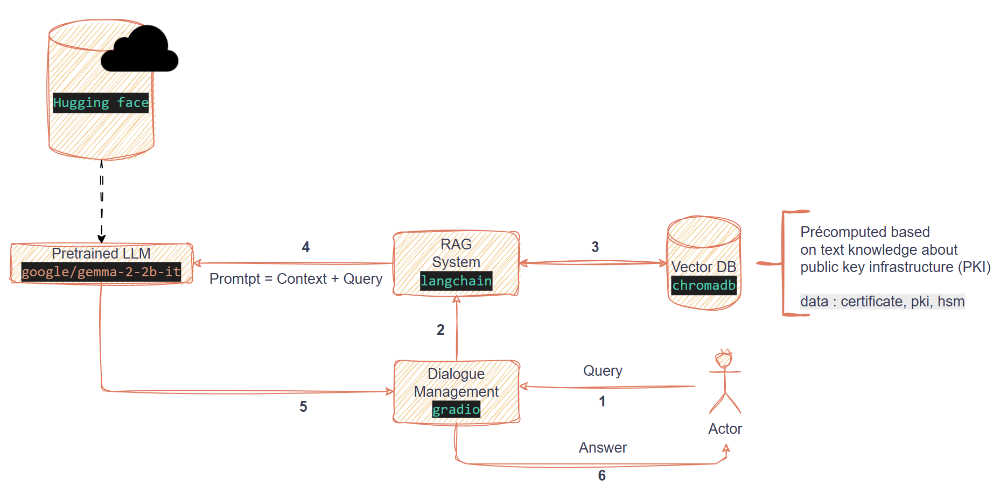

# 🔐 PKI Expert System with RAG

## Goals

Build a Public Key Infrastructure (PKI) expert system using a text-based knowledge base and Retrieval-Augmented Generation (RAG) for context-aware responses.


## Features

* **Retrieval-Augmented Generation (RAG)**
  Combines vector search (via ChromaDB) with text generation (using free models from Hugging Face).

* **LLM Integration**
  Supports models like `google/gemma-2-2b-it` for high-quality response generation.

* **Automated Knowledge Processing**
  Automatically chunks and indexes documents from the local `knowledge/` folder for efficient retrieval.

* **Interactive Dialog Interface**
  Provides a command-line and Gradio-based assistant that retrieves relevant context and generates informed answers.

* **Modular Architecture**
  Easily extend or replace components such as the LLM, vector database, or prompting logic.


## Project Structure

```text
.
│
├── knowledge/                 # Folder containing source documents (e.g., .txt files)
├── llm_loader.py              # Logic for loading the language model (LLM)
├── vector_loader.py           # Text chunking and ChromaDB integration
├── test.py                    # Script or module for testing
├── gr_gui.py                  # Gradio-based graphical user interface
├── dialogue_mngr.py           # Functions for question-answer interaction
├── query.py                   # Logic for handling interactive assistant queries
├── rag.py                     # RAG (Retrieval-Augmented Generation) core implementation
├── main.py                    # Entry point of the application
└── README.md                  # Project documentation
```

## Architecture

